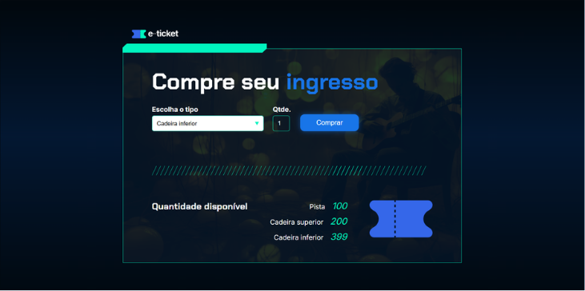

# 🎟️ Ingresso Online

  

---

O **Ingresso Online** é uma aplicação web interativa desenvolvida para simular um sistema de bilheteria digital. A plataforma permite ao usuário selecionar o tipo de ingresso desejado (pista, cadeira superior ou cadeira inferior), informar a quantidade e realizar a compra de forma simples, atualizando a disponibilidade dos assentos em tempo real.

Desenvolvido para praticar lógica de programação, manipulação de variáveis, condicionais e atualização dinâmica de elementos com JavaScript.

---

## 🚀 Funcionalidades

* **Seleção de Setores:** Menu suspenso para escolha entre diferentes setores do evento (Pista, Cadeira Superior e Cadeira Inferior).
* **Validação de Estoque:** O sistema verifica se a quantidade solicitada está disponível antes de confirmar a compra.
* **Atualização em Tempo Real:** Subtrai automaticamente os ingressos comprados do estoque total visível na tela.
* **Alertas de Feedback:** Exibe mensagens instantâneas confirmando o sucesso da compra ou notificando caso os ingressos de um setor estejam esgotados.

---

## 🛠️ Tecnologias Utilizadas

* **HTML5:** Estruturação da página e dos elementos de formulário.
* **CSS3:** Estilização moderna, focada em uma experiência visual limpa e intuitiva de e-commerce.
* **JavaScript (ES6+):** Lógica de compra, controle quantitativo de estoque, uso de condicionais (`if/else`), conversão de tipos de dados (`parseInt`) e manipulação de elementos do DOM.

---

## 🧠 Aprendizados e Desafios

O desenvolvimento deste projeto foi excelente para consolidar conceitos fundamentais do ecossistema front-end:

1. **Gerenciamento de Estado Local:** Controle e atualização de variáveis que representam o estoque disponível para cada setor diretamente na memória da aplicação.
2. **Lógica Condicional Avançada:** Implementação de regras de negócio para impedir compras de valores negativos, zerados ou que ultrapassem o limite disponível.
3. **Reatividade no DOM:** Capturar a ação de clique do usuário, processar a regra de estoque e refletir a nova quantidade disponível na interface imediatamente.

---
